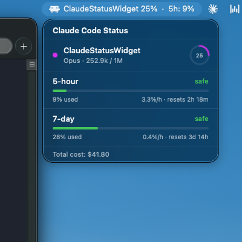

# Claude Status Widget

A native macOS menu bar widget that displays real-time Claude Code session status. Monitor context usage, rate limits, and costs across multiple sessions at a glance.




## Features

- Real-time context window usage per session (tokens used / total)
- 5-hour and 7-day rate limit tracking with burn rate projections
- **Quota history panel** — past 7 days of 5-hour window utilization as a colored bar chart (green / amber / red) plus horizontal gauges for 5h-over-7d and 7d-over-14d averages with peak markers
- "Safe" / "danger" indicators for rate limits
- Multiple concurrent session support
- Stale session detection (greyed out after 5 min inactivity)
- Dead session cleanup (auto-removed 30 min after process exits)
- Click session rows to open project in Finder
- Right-click to copy session info
- Native macOS frosted glass dropdown (MenuBarExtra)

## Requirements

- macOS 13+ (Ventura)
- Apple Silicon (arm64) for the prebuilt binary; Intel Macs must build from source
- [Claude Code](https://docs.anthropic.com/en/docs/claude-code) CLI
- For building from source: Swift 5.9+ and Command Line Tools (Xcode only needed for tests)

## Installation

Two paths: the **quick install** uses the prebuilt `.app` in `dist/` (no Swift toolchain required). The **build-from-source** path compiles locally.

### Option A: Quick install (prebuilt)

```bash
git clone https://github.com/divanshujain/ClaudeStatusWidget.git
cd ClaudeStatusWidget

# Unzip prebuilt app into Applications
unzip dist/ClaudeStatusWidget.app.zip -d ~/Applications/

# Install statusline script + create session-status dir
cp Scripts/statusline-command.sh ~/.claude/statusline-command.sh
chmod +x ~/.claude/statusline-command.sh
mkdir -p ~/.claude/session-status

# If you downloaded the zip via a browser, strip the Gatekeeper quarantine flag.
# (git clone doesn't add it, but zips downloaded from GitHub's web UI do.)
xattr -dr com.apple.quarantine ~/Applications/ClaudeStatusWidget.app 2>/dev/null || true
```

Then jump to [Configure Claude Code statusline](#configure-claude-code-statusline) below.

### Option B: Build from source

```bash
git clone https://github.com/divanshujain/ClaudeStatusWidget.git
cd ClaudeStatusWidget
bash Scripts/install.sh
```

This compiles a release build, installs it to `~/Applications/`, copies the statusline script, and creates the `session-status` directory.

### Configure Claude Code statusline

The widget relies on Claude Code writing a JSON file per session on each turn. Tell Claude Code to use the installed statusline by adding this to `~/.claude/settings.json`:

```json
{
  "statusLine": {
    "type": "command",
    "command": "bash ~/.claude/statusline-command.sh"
  }
}
```

If you already have a `statusLine` entry, replace it with the above. Without this, the widget will show "No active sessions" and the Quota panel will stay empty.

### Launch the widget

```bash
open ~/Applications/ClaudeStatusWidget.app
```

First launch on a prebuilt download from the browser may trigger Gatekeeper's "unidentified developer" warning — right-click the app → **Open** → **Open**, once. The binary is ad-hoc signed (not notarized).

To auto-start on login: **System Settings > General > Login Items > Add ClaudeStatusWidget**.

### Start a Claude Code session

```bash
claude
```

The menu bar updates in real-time as you interact with Claude. The Quota panel begins populating after the first 5-hour window completes; until then it displays "Collecting…".

## How It Works

```
Claude Code session
  -> statusline script fires on each turn
  -> writes JSON to ~/.claude/session-status/<session_id>.json
  -> widget's file watcher detects the change
  -> menu bar and dropdown update instantly
```

Each session writes its own JSON file containing context usage, rate limits, model, cost, and other metadata. The widget watches the `~/.claude/session-status/` directory and updates the UI whenever a file changes.

The Quota panel has its own pipeline: `RateLimitHistoryWriter` watches the same directory and appends deduplicated rows to `~/.claude/rate-limit-history.csv` every time a session's 5h/7d pct or reset timestamp changes. The file is capped at 10,000 rows (~900 KB) with oldest rows rolled off first — roughly 4 months of history in practice.

### Timers

| Timer | Interval | Purpose |
|-------|----------|---------|
| File watcher | Instant | Detects session data changes via DispatchSource |
| Staleness check | 30s | Greys out sessions with no updates for 5+ minutes |
| Dead process cleanup | 30s | Removes sessions whose process has exited (after 30 min) |
| Rate limit refresh | 60s | Recalculates countdown timers from stored reset timestamps |

## Building from Source

```bash
swift build              # Debug build
swift build -c release   # Release build
swift test               # Run tests (requires Xcode)
bash Scripts/bundle.sh   # Create .app bundle in build/
bash Scripts/install.sh  # Build + install to ~/Applications
```

## Project Structure

```
Sources/ClaudeStatusWidget/
  ClaudeStatusWidgetApp.swift    # App entry, MenuBarExtra, session watcher setup
  Models/
    SessionData.swift            # Codable models for session JSON
    RateLimitStatus.swift        # Burn rate calculator, severity levels
    RateLimitHistory.swift       # History entry model + CSV parser + aggregator
    SessionColorPalette.swift    # Color assignments per session
  Services/
    SessionManager.swift         # Session lifecycle, staleness, cleanup
    SessionWatcher.swift         # DispatchSource directory watcher
    RateLimitHistoryLoader.swift # Watches history CSV, publishes aggregated stats
    RateLimitHistoryWriter.swift # Samples session-status JSONs, appends to CSV (deduped, capped)
  MenuBar/
    StatusBarController.swift    # NSStatusItem pill rendering (unused with MenuBarExtra)
    PillView.swift               # Custom pill view (unused with MenuBarExtra)
  Popover/
    PopoverContentView.swift     # Dropdown container
    SessionRowView.swift         # Session row with progress ring
    RateLimitsView.swift         # Rate limit bars and status
    QuotaView.swift              # Bar chart (past 7d of 5h windows) + 5h/7d gauges
Scripts/
  statusline-command.sh          # Claude Code statusline script
  install.sh                     # Build + install automation
  bundle.sh                      # .app bundle creation
dist/
  ClaudeStatusWidget.app.zip     # Prebuilt arm64 release (ad-hoc signed)
```

## License

MIT
